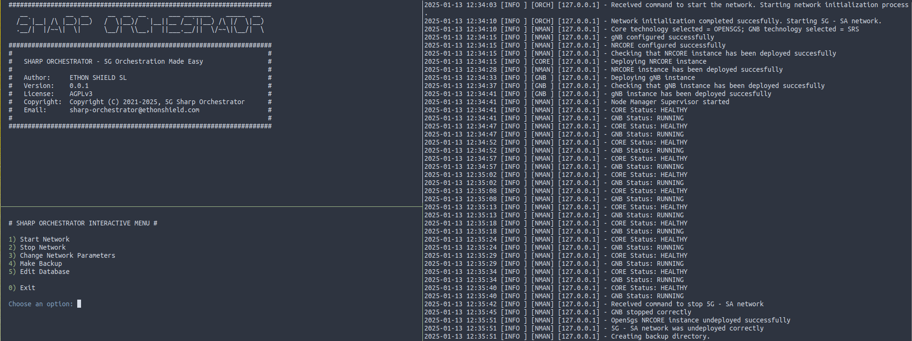
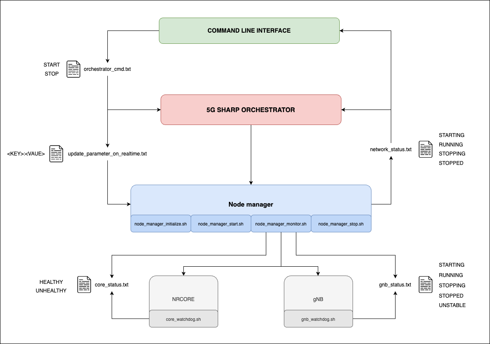
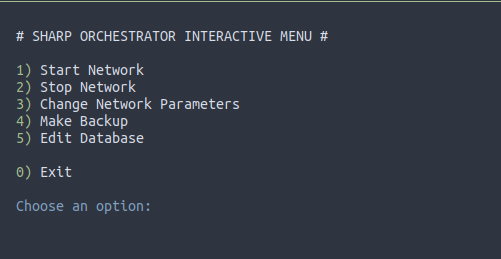
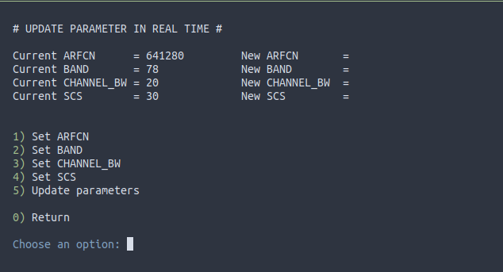
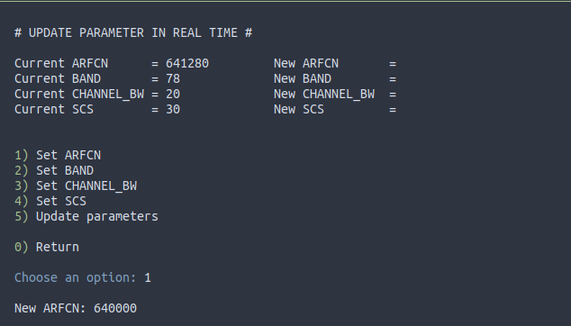
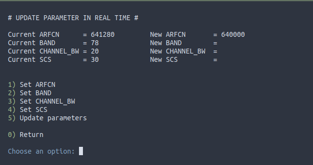
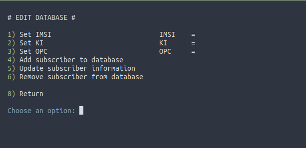
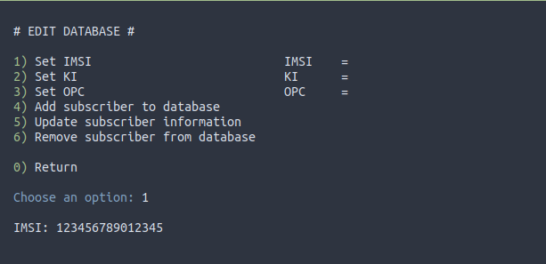
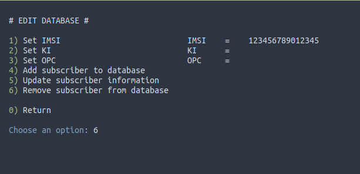

# 5G SHARP ORCHESTRATOR

"5G Orchestration made easy"

This tool serves as a comprehensive wrapper for configuring, deploying and monitoring 5G open-source network components, simplifying the orchestration process. 

Currently, the supported open-source components are:
- CORE (NRCORE):
    - OAI: https://gitlab.eurecom.fr/oai/cn5g/oai-cn5g-fed 
    - Open5GS: https://open5gs.org/open5gs/docs/guide/02-building-open5gs-from-sources/ 
- RAN (gNB):
    - OAI: https://gitlab.eurecom.fr/oai/openairinterface5g/
    - srsRAN: https://docs.srsran.com/projects/project/en/latest/user_manuals/source/installation.html

## Authors

ETHON SHIELD SL (https://www.ethonshield.com/home)

Please contact us at: sharp-orchestrator@ethonshield.com

## Disclaimer

This tool is provided for educational and research purposes only. The authors and contributors of this tool do not accept any responsibility for any misuse, damage or negative consequences that may arise from its application. By using this tool, you acknowledge that you are solely responsible for your action and any outcomes resulting from its operation.

The authors encourage users to apply ethical considerations and comply with all applicable laws and regulations when interacting with this tool. 

# Why 5G Sharp Orchestrator?

Building and deploying a stable 5G network using open-source software can be complex and time-consuming. This tool simplifies the process, offering developers and researchers an intuitive interface to study and analyze 5G networks. 

Additionally, the project is designed to integrate with all existing open-source 5G software, enabling researchers to explore the diverse solutions developed by the community.

# Table of Contents

-   [Features](#features)
-   [Usage](#usage)
-   [Configuration](#configuration)
-   [Installation](#installation)
-   [Execution](#execution)
-   [Viewing PCAP files](#viewing-pcap-files)
-   [License](#license)
-   [Contributing](#contributing)


# Features

This project offers the following features:

**1. NRCORE only deployment**

- Deployment of 5G NRCORE network with pre-configured parameters. 
- Posibility to start and stop the network as desired.
- Report of network state and control over network functions stability.

**2. NRCORE and gNB deployment**

- Deployment of 5G NRCORE network and gNB with pre-configured parameters. 
- Posibility to start and stop the network as desired.
- Report of each component's state and control over network stability.

Currently, there are two supported deployment options: 
1. One host, holding both the NRCORE as well as the gNB
2. Two hosts, one holding the NRCORE and the other one the gNB (**RECOMMENDED**)

**3. Real time update of gNB parameters**

- Capacity to update gNB parameters without undeploying NRCORE network.

The current supported parameters to be updated are:
- ARFCN (OAI & SRS)
- POINT_A (OAI)
- BAND (SRS)
- CHANNEL_BW (SRS)
- SCS (SRS)

**4. NRCORE database edition**

- Capacity to edit NRCORE database, adding, editing and removing subscribers

**5. Backup during execution**

- Posibility to create a backup directory at any time during execution, even if the network is deployed and running.
- Backup includes log files, configuration parameters, and traffic captures. 

# Usage

This section provides a basic example of the projects usage. 

**1. Configuring the project**

The first thing that has to be done is setting the [configuration file](./conf/sharp-orchestrator.src), you can follow the section [Configuration](#configuration) for more details. In this file you will be able to set different network parameters such as the MCC, MNC or TAC, the open-source projects to use, as well as defining the file paths of the corresponding binaries. 

**2. Checking the configuation**

Once the project has been configured accordingly, you can check if it has been correctly configured executing the next script: `./bin/check_conf.sh`. All checks should have a **YES**.

<details>
    <summary><strong> Example output </strong></summary>

```txt
##################################
Checking basic directories
##################################
BASIC directories are OK

##################################
Checking necessary binaries
##################################
tshark ... YES
expect ... YES
tmux ... YES
uhd_find_devices ... YES
uhd_usrp_probe ... YES
open5gs-nrfd ... NO
open5gs-scpd ... NO
open5gs-amfd ... NO
open5gs-smfd ... NO
open5gs-upfd ... NO
open5gs-ausfd ... NO
open5gs-udmd ... NO
open5gs-pcfd ... NO
open5gs-nssfd ... NO
open5gs-bsfd ... NO
open5gs-udrd ... NO

##################################
Checking CORE IP address, username and working dir
##################################

CORE IP ADDRESS ... YES
CORE USERNAME ... YES
CORE WORKING DIR ... NO - NRCORE_WORKING_DIR: /home/sharp-orchestrator//nodes/core
Checking if open5gs services are active 

MongoDB is running ... YES

##################################
Checking SSH connections
##################################

CORE --> GNB ... NO - gNB IP address 127.0.0.1 not reachable
GNB --> CORE ... NO - Couldn't check this direction as gNB IP address is not reachable

##################################
Checking necessary repositories & binaries
##################################

OPEN5GS CORE
/home/sharp-orchestrator// directory... NO 
gNB
     SRS gnb bin ... NO - Couldn't check, no access via ssh

##################################
Checking sudoers file
##################################

NOPASSWD in ORCH & CORE for sharp-orchestrator for command /usr/bin/kill -9 \* ... YES
NOPASSWD in ORCH & CORE for sharp-orchestrator for command /usr/bin/chown -R \* /tmp ... YES
NOPASSWD in ORCH & CORE for sharp-orchestrator for command /usr/bin/chown -R \* /logs ... YES
NOPASSWD in ORCH & CORE for sharp-orchestrator for command /usr/bin/python3 core-network.py --type start-basic ... YES
NOPASSWD in ORCH & CORE for sharp-orchestrator for command /usr/bin/python3 core-network.py --type stop-basic ... YES
NOPASSWD in ORCH & CORE for sharp-orchestrator for command /usr/sbin/ip tuntap add name ogstun mode tun ... YES
NOPASSWD in ORCH & CORE for sharp-orchestrator for command /usr/sbin/ip addr del 10.45.0.1/16 dev ogstun ... YES
NOPASSWD in ORCH & CORE for sharp-orchestrator for command /usr/sbin/ip addr add 10.45.0.1/16 dev ogstun ... YES
NOPASSWD in ORCH & CORE for sharp-orchestrator for command /usr/sbin/ip addr del 2001\:db8\:cafe\:\:1/48 dev ogstun ... YES
NOPASSWD in ORCH & CORE for sharp-orchestrator for command /usr/sbin/ip addr add 2001\:db8\:cafe\:\:1/48 dev ogstun ... YES
NOPASSWD in ORCH & CORE for sharp-orchestrator for command /usr/sbin/ip link set ogstun up ... YES
NOPASSWD in ORCH & CORE for sharp-orchestrator for command /usr/sbin/sysctl net.ipv4.conf.all.forwarding\=1 ... YES
NOPASSWD in ORCH & CORE for sharp-orchestrator for command /usr/sbin/iptables -P FORWARD ACCEPT ... YES
NOPASSWD in ORCH & CORE for sharp-orchestrator for command /usr/sbin/iptables -S ... YES

##################################
Checking sharp-orchestrator.src parameters
##################################

MCC 001 ... YES
MNC 01 ... YES
DEBUG false ... YES
DEPLOY_NRCORE_ONLY false ... YES
DNS_IP_ADDRESS 8.8.8.8 ... YES
AMF_IP_ADDRESS 127.0.0.100 ... YES
SHARP_ORCHESTRATOR_IP_ADDRESS 127.0.0.1 ... YES
NRCORE_IP_ADDRESS 127.0.0.1 ... YES
GNB_IP_ADDRESS 127.0.0.1 ... YES

##################################
Checking gNB directory
##################################

GNB directory ... NO - gNB IP address 127.0.0.1 not reachable
```

</details>

**3. Executing the project**

After checking the configuration file and setting every paramater correctly, you will be able to start the orchestration process. For this you will have to execute the following script: `./bin/tui.sh`



For more details on the execution, please follow the section [Execution](#execution) 

# Configuration

The orchestrator, that will be incorporated in the machine that hosts the NRCORE, will manage the different nodes of the network. The next diagram shows the architecture and interaction of the different elements in the project:



To configure the 5G Sharp Orchestrator you will need to modify the corresponding parameters in `./conf/sharp-orchestrator.src` file. The following are the variables that can be configured. 

**SHARP ORCHESTRATOR**:
- **SHARP_ORCHESTRATOR_IP_ADDRESS** - IP address where the repository has been cloned, same as NRCORE
- **SHARP_ORCHESTRATOR_USERNAME** - Name of the user that holds the sharp-orchestrator project, same as NRCORE
- **SHARP_ORCHESTRATOR_WORKING_DIR** - Directory where the sharp-orchestrator project has been cloned

**GENERAL**:

- **MCC** - Mobile Country Code - 3 digits decimal number
- **MNC** - Mobile Network Code - 2 or 3 digits decimal number
- **TAC** - Tracking Area Core - Decimal number
- **DEBUG** - Show debug logs - "true" or "false"
- **DNS_IP_ADDRESS** - IP address of the DNS server - default 8.8.8.8
- **DEPLOY_NRCORE_ONLY** - Deploy only the nrcore - "true" or "false"
- **BACKUP_DIR_PREFIX** - String to use as prefix for the backup directory generated after every execution 

**NRCORE**:

- **NRCORE_TECH** - Type of technology to deploy as 5g network core - "OAI" or "OPEN5GS"
- **INT_ALGO_PRIORITY_LIST** - Integrity algorithm priority list, separated by commas.\
                               Supported values in OAI: NIA0,NIA1,NIA2,NIA3,NIA4,NIA5,NIA6,NIA7\
                               Supported values in Open5GS: NIA0,NIA1,NIA2,NIA3

- **CIPH_ALGO_PRIORITY_LIST** - Ciphering algorithm priority list, separated by commas.\
                                Supported values in OAI: NEA0,NEA1,NEA2,NEA3,NEA4,NEA5,NEA6,NEA7\
                                Supported values in Open5GS: NEA0,NEA1,NEA2,NEA3

_Specific to OAI technology_

- **NRCORE_DEPLOYMENT_VERSION** - OAI docker images version used: "v2.0.1" or "v2.1.0"
- **NRCORE_OAI_WD** - Path where oai-cn5g-fed repository has been cloned 
- **NRCORE_DC_IMAGES_TAGS_PERSONALIZED** - Define any specific docker images that want to be used instead of the default ones.  
                                           The format is ["<NF_name>"]="<docker_image_name:docker_image_tag>"  
                                           <NF_name> options: "AMF", "NRF", "SMF", "UPF", "AUSF", "UDR", "UDM", "UPF-VPP", "TRF-GEN-CN5G"  

_Specific to Open5GS technology_

- **NRCORE_OPEN5GS_WD** - Path where open5gs repository has been cloned

**GNB**:

- **GNB_TECH** - Type of technology to deploy a gnb node - "OAI" or "SRS"
- **GNB_IP_ADDRESS** - IP Address of the machine that holds the software of the gnb
- **GNB_USERNAME** - Valid username on the machine that holds the software of the gnb
- **GNB_WORKING_DIR** - Specify directory where gNB files are going to be stored.
It is recommended to create one as all the files inside the specified one will be deleted
- **ARFCN** - ARFCN used 

_Specific to OAI technology_

- **NR_SOFTMODEM_BIN** - Path of the binary file that executes the software of the gnb in the remote machine 
- **POINT_A** - Reference point A for the selected ARFCN

_Specific to srsRAN technology_

- **SRS_GNB_BIN** - Path of the binary file that executes the software of the gnb in the remote machine
- **BAND** - ARFCN band used
- **CHANNEL_BW** - Channel Bandwidth
- **SCS** - Subcarrier spacing (in kHz). Options are: "15", "30", "60", "120" and "240"

**Not connected to a network**

If you are offline, please use 127.0.0.1 as the IP addresses for the SHARP_ORCHESTRATOR_IP_ADDRESS and GNB_IP_ADDRESS.

### SUDOERS file 

It will be necessary to modify /etc/.sudoers file (via visudo for example) in order to be able to execute certain commands that need root privileges:

**ORCHESTRATOR & CORE**
```bash
<YOUR_USER> ALL=(ALL) NOPASSWD: \
/usr/bin/kill -9 *, \
/usr/bin/chown -R * /tmp, \
/usr/bin/chown -R * /logs, \
/usr/bin/python3 core-network.py --type start-basic, \
/usr/bin/python3 core-network.py --type stop-basic, \
/usr/sbin/ip tuntap add name ogstun mode tun, \
/usr/sbin/ip addr del 10.45.0.1/16 dev ogstun, \
/usr/sbin/ip addr add 10.45.0.1/16 dev ogstun, \
/usr/sbin/ip addr del 2001\:db8\:cafe\:\:1/48 dev ogstun, \
/usr/sbin/ip addr add 2001\:db8\:cafe\:\:1/48 dev ogstun, \
/usr/sbin/ip link set ogstun up, \
/usr/sbin/sysctl net.ipv4.conf.all.forwarding=1, \ 
/usr/sbin/iptables -P FORWARD ACCEPT, \
/usr/sbin/iptables -S, \
```

**GNB**
```bash
<YOUR_USER> ALL=(ALL) NOPASSWD: \
/usr/sbin/ip route del *, \
/usr/sbin/ip route add *, \
/usr/bin/unbuffer *, \
/usr/bin/kill -9 * 
```

### SSH KEYS

Furthermore, for the nodes to be able to talk to each other via ssh, it is important to store the public ssh keys of the corresponding users. 

1. Generate ssh key pair: `ssh-key-gen -t rsa`
2. Copy public pair into remote machine: `ssh-copy-id -i ~/.ssh/id_rsa.pub <remote_username>@<remote_ip_address>`

# Installation

## Prerequisites

**Software prerequisites**

This project needs certain binaries to be installed on the different machines that will be used:

- The project has been successfully tested with **Ubuntu 22.04** 
- UHD built from source (https://files.ettus.com/manual/page_build_guide.html)
- docker **version 19.03.0 or higher** (https://docs.docker.com/engine/install/ubuntu/)
```
# User going to be used should be in the docker group
sudo usermod -aG docker <user>
newgrp docker
```
- docker-compose **version 1.29.2 or higher** (https://docs.docker.com/compose/install/linux/)
- tmux **version 3.5a** (https://github.com/tmux/tmux/releases)

```bash
wget https://github.com/tmux/tmux/releases/download/3.5a/tmux-3.5a.tar.gz
tar -zxf tmux-3.5a.tar.gz
cd tmux-3.5a
./configure
make
sudo make install
```

- wireshark, tshark, expect

```bash
sudo add-apt-repository ppa:wireshark-dev/stable
sudo apt update
sudo apt install wireshark tshark expect
```

**Hardware prerequisites**

- USRP devices.
- USB 3.0 port to connect the SDR.
- It is recommended to at least have an i7 processor.

## Download NRCORE repositories

<details>
    <summary><strong>Open Air Interface (OAI) CORE</strong></summary>

Official documentation: https://gitlab.eurecom.fr/oai/cn5g/oai-cn5g-fed

1. Pull base images:

```
docker pull ubuntu:jammy
docker pull ubuntu:bionic
docker pull mysql:5.7
```

2. Pull core nodes images. The current tested versions are 2.0.1 and 2.1.0.

```
./pull_docker_images.sh -v 2.1.0
```

3. Download oai repository:
```
# Clone directly on the latest release tag
git clone --branch v2.1.0 https://gitlab.eurecom.fr/oai/cn5g/oai-cn5g-fed.git
cd oai-cn5g-fed
# If you forgot to clone directly to the latest release tag
git checkout -f v2.1.0
```
For other versions, specify it in the --branch option, and check out accordingly

**CAUTION** - If you want more than one version at the same time be careful with the name of the repository.

4. Synchronize all git submodules
```
./scripts/syncComponents.sh
```

</details>

<details>
<summary><strong>Open5Gs Core</strong></summary>

Official documentation: https://open5gs.org/open5gs/docs/guide/02-building-open5gs-from-sources/

To work with Open5GS core, it is recommended to build the project from source.

**1. Getting MongoDB**

- Install GNU Privacy Guard tool:

```
sudo apt update
sudo apt install gnupg
```

- Import the public key used by the package management system:

```
curl -fsSL https://pgp.mongodb.com/server-7.0.asc | sudo gpg -o /usr/share/keyrings/mongodb-server-7.0.gpg --dearmor

echo "deb [ arch=amd64,arm64 signed-by=/usr/share/keyrings/mongodb-server-7.0.gpg ] https://repo.mongodb.org/apt/ubuntu jammy/mongodb-org/7.0 multiverse" | sudo tee /etc/apt/sources.list.d/mongodb-org-7.0.list
```

- Install the MongoDB packages:
```
sudo apt update
sudo apt install -y mongodb-org
```

**NOTE**: MongoDB service needs to be running in order to execute the project. This can be done using the command ``sudo systemctl start mongod ``

**2. Building Open5GS**

Install the required dependencies:

```
sudo apt install python3-pip python3-setuptools python3-wheel ninja-build build-essential flex bison git cmake libsctp-dev libgnutls28-dev libgcrypt-dev libssl-dev libidn11-dev libmongoc-dev libbson-dev libyaml-dev libnghttp2-dev libmicrohttpd-dev libcurl4-gnutls-dev libnghttp2-dev libtins-dev libtalloc-dev meson
```
Clone the official project repository:
```
git clone https://github.com/open5gs/open5gs
```
Compile with <i>meson</i> and build with <i>ninja</i>:
```
cd open5gs/ meson build --prefix=`pwd`/install
ninja -C build
```
Check wether the compilation is correct:
```
 ./build/tests/registration/registration
```
Run all test programs:
```
cd build
sudo meson test -v
```
Perform the installation process:
```
cd build
ninja install
cd ../
```
</details>

## Download gNB repositories

<details>
<summary><strong>OAI gNB</strong></summary>

Official documentation: https://gitlab.eurecom.fr/oai/openairinterface5g/

**1. Clone the repository**
```
git clone https://gitlab.eurecom.fr/oai/openairinterface5g.git
cd openairinterface5g/
sudo git checkout develop
source oaienv
cd cmake_targets
```

**2. Build the binaries**

**IMPORTANT**: Build script will install UHD drivers from apt by default. As UHD has been installed from source (Section [Prerequisites](#Prerequisites)), it is recommended to **COMMENT** the following lines from the script "build_oai" (**CAUTION**: line numbers may vary slightly).

```
448       check_install_usrp_uhd_driver
449       if [ ! -v BUILD_UHD_FROM_SOURCE ] && [ ! "$DISABLE_HARDWARE_DEPENDENCY" == "True" ]; then
450         install_usrp_uhd_driver $UHD_IMAGES_DIR
451       fi
```

Once the lines have been commented, compile the corresponding binaries. 
```
sudo ./build_oai -I -w USRP --gNB 
```

**NOTE**: Check that all the *.so files generated in the ran_build/build/ directory are in /usr/lib/.

**NOTE**: The gNB (nr-softmodem) application requires the PC processor to have the **AVX2** flag, check the information in the _flags_ section in the /proc/cpuinfo file: `$ cat /etc/cpuinfo`

Download the UHD FPGA images in a specific file:
```
sudo uhd_images_downloader -i /usr/share/uhd/images/
```
</details>

<details>
<summary><strong>srsRAN gNB</strong></summary>

Official documentation: https://docs.srsran.com/projects/project/en/latest/user_manuals/source/installation.html

**1. Installing build tools and dependencies**

The required build tools and dependencies for the project can be installed in Ubuntu using the following command:
```
sudo apt-get install cmake make gcc g++ pkg-config libfftw3-dev libmbedtls-dev libsctp-dev libyaml-cpp-dev libgtest-devg
```

**2. Clone and build**

Clone the project repository:
```
git clone https://github.com/srsRAN/srsRAN_Project.git
```

Build the code-base:
```
cd srsRAN_Project
mkdir build
cd build
cmake ../
make -j $(nproc)
make test -j $(nproc)
sudo make install
```
</details>

# Execution  

This project can be executed through an interactive menu (RECOMMENDED) or the command line. 

<details>
    <summary><strong> Interactive Menu </strong></summary>

##### CONFIGURING THE NETWORK

To configure the network it is essential to modify multiple parameters in the `sharp-orchestrator/conf/sharp-orchestrator.src` file. 

##### CHECKING CONFIGURED PARAMETERS
Check different parameters configured in the sharp-orchestrator.src

```bash
./check_conf.sh
```

##### STARTING THE ORCHESTRATOR APP

To start the orchestrator app execute the following command:
```bash
./tui.sh
```

You will have an interactive menu to perform all the needed actions.



##### STARTING THE NETWORK

Choose the "Start network" option in the interactive menu --> "1"

##### STOPPING THE NETWORK

Choose the "Stop network" option in the interactive menu --> "2"

##### UPDATE GNB PARAMETERS ON REAL-TIME

Some parameters in the gNB can be updated on real-time. This is done to prevent the undeployment of the core network and slowing the whole process. 

The current supported parameters to be updated are:
- ARFCN (OAI & SRS)
- POINT_A (OAI)
- BAND (SRS)
- CHANNEL_BW (SRS)
- SCS (SRS)

Choose the "Change network parameters" option in the interactive menu --> "3"

This will show a sub menu with the different options:
- Setting the different parameters
- Updating them 



Before updating any parameter, you need to set the value. For that, choose the corresponding "set" option and the value to set will be asked.
The new set value will appear in the menu, as it is shown in the images below





After setting all the values you want to update, choose the "Update parameters" option in the interactive menu for the changes to take place.
This action will stop the running gNB instance and start a new one with the updated parameters. 
Any error in the gNB execution due to invalid parameters selection will be prompted in the log screen.


##### BACKING UP FILES DURING EXECUTION

Stopping the network will automatically perform a backup. This options is used if you want to perform a backup during the execution without stopping the network. 
The backup will be saved in the sharp-orchestrator/backups directory.

Making a backup will save the following files: 
```
├── logs -> DIR that includes all the logs from the network nodes
├── pcaps -> DIR that includes all the pcaps from the network nodes
├── conf -> DIR that includes the latest configuration files of the network nodes
└── sharp_orchestrator.log -> Orchestration log
```

Choose the "Make backup" option in the interactive menu --> "4"

##### MANAGE SUBSCRIBERS IN DATABASE

To be able to connect subscribers to the deployed network they need to be provisioned in the corresponding databases. 

Choose the "Edit Database" option in the interactive menu --> "5"

This will show a sub menu with the different options:
- Setting the different parameters (IMSI, KI, OPC)
- Adding a subscriber to the database - needed parameters: IMSI, KI, OPC
- Updating a subscriber in the database - needed parameters: IMSI, KI, OPC
- Removing a subscriber from the database - needed parameters: IMSI



Before performing an action to a subscriber, you need to add the required information. For that set the different parameters.

The next image shows an example of setting the IMSI:



After setting the IMSI, you would be able to remove it from the database, by chossing the option "Remove subscriber from the database" --> 6



</details>

<details>
    <summary><strong> Command line </strong></summary>

##### STARTING THE ORCHESTRATOR APP

To start the orchestrator app execute the following command:
```bash
./5g-sharp-orchestrator.sh
```

##### CONFIGURING THE NETWORK

To configure the network it is essential to modify multiple parameters in the `sharp-orchestrator/conf/sharp-orchestrator.src` file. 

##### CHECKING CONFIGURED PARAMETERS
Check different parameters configured in the sharp-orchestrator.src

```bash
./check_conf.sh
```

##### STARTING THE NETWORK

```bash
echo "START" > sharp-orchestrator/tmp/orchestrator_cmd.txt
```

##### STOPPING THE NETWORK

```bash
echo "STOP" > sharp-orchestrator/tmp/orchestrator_cmd.txt
```

##### UPDATE GNB PARAMETERS ON REAL-TIME

Some parameters in the gNB can be updated on real-time. This is done to prevent the undeployment of the core network and slowing the whole process. 

The current supported parameters to be updated are:
- ARFCN (OAI & SRS)
- POINT_A (OAI)
- BAND (SRS)
- CHANNEL_BW (SRS)
- SCS (SRS)

To modify multiple parameters at once, separate the values with ";"

```bash
# One parameter update
echo "ARFCN:<ARFCN_VALUE>" > sharp-orchestrator/tmp/update_parameter_on_real_time.txt

# Multiple parameters update
echo "ARFCN:<ARFCN_VALUE>;POINT_A:<POINT_A_VALUE>" > sharp-orchestrator/tmp/update_parameter_on_real_time.txt
```

##### BACKING UP FILES DURING EXECUTION

Stopping the network will automatically perform a backup. This options is used if you want to perform a backup during the execution without stopping the network. 
The backup will be saved in the sharp-orchestrator/backups directory.

Making a backup will save the following files: 
```
├── logs -> DIR that includes all the logs from the network nodes
├── pcaps -> DIR that includes all the pcaps from the network nodes
├── conf -> DIR that includes the latest configuration files of the network nodes
└── sharp_orchestrator.log -> Orchestration log
```

```bash
./make_backup_files.sh
```

##### MANAGE SUBSCRIBERS IN DATABASE

To be able to connect subscribers to the deployed network they need to be provisioned in the corresponding databases. 

```bash
./database_manager.sh -c <command> -i <imsi> [-k <ki>] [-o <opc>]

Mandatory arguments:
-c <command>  add, update, remove
add         Adds a new subscriber to the database. Requires -i <imsi> -k <ki> -o <opc>
update      Updates the information of a subscriber. Requires -i <imsi> -k <ki> -o <opc>
remove      Removes an existing subscriber from the database. Requires -i <imsi>

Optional arguments:
-h            print this help message
```

</details>

# Viewing PCAP files

- Go to Analyze --> Enabled Protocols --> check the box mac_nr and mac_nr_udp
- Sometimes, when debugging the PCAP files, the traffic is encrypted using EEA0. To view this traffic, in Wireshark go to Edit -> Preferences -> Protocols -> NAS-5GS -> check box "Try to detect and decode 5G-EA0 ciphered message"

# License

This tool is free software; you can redistribute it and/or modify it under the terms of the AGPLv3. For more information, please check the [LICENSE](./LICENSE) file. 

# Contributing

For bug reporting and feature requests, please follow the [CONTRIBUTING GUIDELINE](./CONTRIBUTING.md) file.

